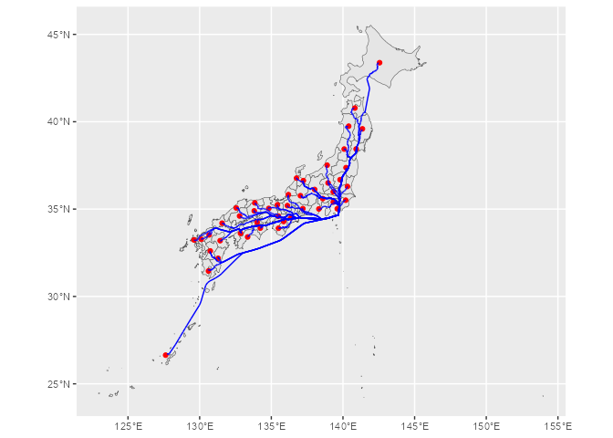

<!-- README.md is generated from README.Rmd. Please edit that file -->

# jptransnet

<!-- badges: start -->
<!-- badges: end -->

The goal of jptransnet is to …

## Installation

You can install the development version of jptransnet from
[GitHub](https://github.com/) with:

``` r
# install.packages("devtools")
devtools::install_github("UchidaMizuki/jptransnet")
```

## Example

This is a basic example which shows you how to solve a common problem:

``` r
library(jptransnet)
library(tidyverse)
library(sf)
library(sfnetworks)
```

### `transport_network()`

- Source: <https://www.gsi.go.jp/kankyochiri/gm_japan_e.html>
- Terms of use: <https://www.gsi.go.jp/ENGLISH/page_e30286.html>

``` r
# pak::pak("uchidamizuki/jptransnetdata")
network <- transport_network()
network
#> # A sfnetwork with 23584 nodes and 38776 edges
#> #
#> # CRS:  EPSG:6668 
#> #
#> # An undirected multigraph with 1 component with spatially explicit edges
#> #
#> # A tibble: 23,584 × 2
#>   transport            geometry
#>   <fct>             <POINT [°]>
#> 1 road       (141.7879 45.4044)
#> 2 road        (141.7918 45.405)
#> 3 road       (141.7768 45.4048)
#> 4 road      (141.6788 45.41846)
#> 5 road       (141.7077 45.3958)
#> 6 road      (141.8185 45.38713)
#> # ℹ 23,578 more rows
#> #
#> # A tibble: 38,776 × 16
#>    from    to transport f_code   acc   exs   rst   med   rtt   RSU   loc soc  
#>   <int> <int> <fct>     <chr>  <int> <int> <int> <int> <int> <int> <int> <chr>
#> 1     1     2 road      AP030      1    28     1     0    14     1     8 JPN  
#> 2     1     3 road      AP030      1    28     1     0    15     1     8 JPN  
#> 3     1     3 road      AP030      1    28     1     0    14     1     8 JPN  
#> # ℹ 38,773 more rows
#> # ℹ 4 more variables: fco <int>, tuc <int>, length [m],
#> #   geometry <LINESTRING [°]>
```

### `transport_network_distance()`

``` r
prefecture <- rnaturalearth::ne_states("japan") |> 
  arrange(iso_3166_2) |> 
  select(iso_3166_2, name)
centroid_prefecture <- st_centroid(prefecture)
#> Warning: st_centroid assumes attributes are constant over geometries

distance <- network |> 
  transport_network_distance(from = centroid_prefecture,
                             to = centroid_prefecture)
distance[1:5, 1:5]
#> Units: [m]
#>           [,1]      [,2]       [,3]      [,4]      [,5]
#> [1,]  13880.33 385912.09 525817.988 641652.24 572144.87
#> [2,] 385912.09   7466.23 205844.524 321379.69 197477.06
#> [3,] 525817.99 205844.52   9549.477 148505.86 166470.43
#> [4,] 641652.24 321379.69 148505.857   1536.67 213993.69
#> [5,] 572144.87 197477.06 166470.428 213993.69  13852.28
```

### `transport_network_path()`

``` r
path <- network |> 
  transport_network_path(from = centroid_prefecture[13, ],
                         to = centroid_prefecture)
path
#> # A tibble: 47 × 3
#>    nodes          edges             length
#>    <list>         <list>               [m]
#>  1 <sf [173 × 3]> <sf [172 × 17]> 1079507.
#>  2 <sf [188 × 3]> <sf [187 × 17]>  759234.
#>  3 <sf [138 × 3]> <sf [137 × 17]>  586360.
#>  4 <sf [99 × 3]>  <sf [98 × 17]>   440883.
#>  5 <sf [137 × 3]> <sf [136 × 17]>  645261.
#>  6 <sf [96 × 3]>  <sf [95 × 17]>   465242.
#>  7 <sf [54 × 3]>  <sf [53 × 17]>   313379.
#>  8 <sf [60 × 3]>  <sf [59 × 17]>   185476.
#>  9 <sf [60 × 3]>  <sf [59 × 17]>   218299.
#> 10 <sf [76 × 3]>  <sf [75 × 17]>   223891.
#> # ℹ 37 more rows

path |> 
  select(edges) |> 
  unnest(edges) |> 
  st_as_sf() |> 
  ggplot() +
  geom_sf(data = prefecture) +
  geom_sf(data = centroid_prefecture,
          color = "red") +
  geom_sf(color = "blue")
```


